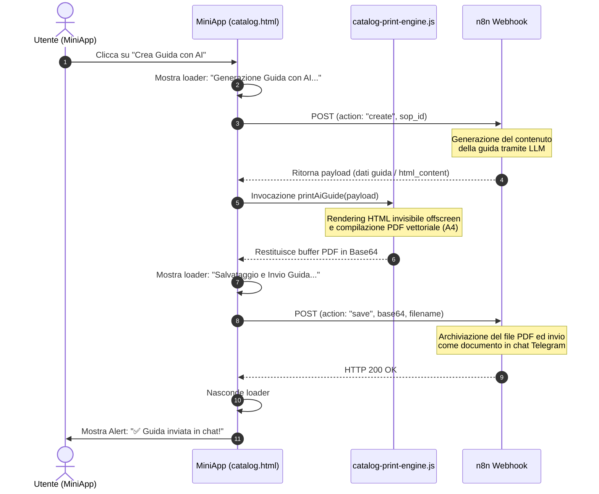

# Flusso di Generazione della Guida con IA per Asset Digitali

Questo documento descrive il funzionamento tecnico e operativo del flusso di creazione automatica e stampa in PDF delle guide generate con Intelligenza Artificiale per i prodotti catalogati sotto la categoria **"Asset digitali"**.

---

## 1. Condizioni di Attivazione
La card di gestione **"Crea Guida con AI"** viene mostrata dinamicamente nell'interfaccia di dettaglio del catalogo (`currentViewLevel === 'actions'`) al verificarsi di due condizioni simultanee:
1. L'elemento selezionato è di tipo **Prodotto** (la macro-categoria attiva è `PRO` o il tipo di elemento nel database è `PRODUCT`).
2. La categoria di appartenenza dell'elemento contiene il nome **"Asset digitali"** (ricerca case-insensitive sulle proprietà `name` o `short_name` della categoria attiva).

---

## 2. Diagramma del Flusso di Lavoro (Workflow)

Il processo si sviluppa in una sequenza asincrona coordinata tra il client (MiniApp Telegram), il motore di stampa locale (`CatalogPrintEngine`) e l'endpoint di automazione di n8n:



---

## 3. Dettagli di Implementazione Tecnica

### Fase 1: Chiamata di Creazione (`action: "create"`)
Al click sulla card, viene inviata una richiesta POST all'endpoint dedicato:
* **URL**: `https://prod.workflow.trinai.it/webhook/ab2f9701-2cf6-42ed-834e-ada69a01b3eb`
* **Payload inviato**:
  ```json
  {
    "action": "create",
    "sop_id": "SVC_7KNE44IQ",
    "ash": "session_ash_here",
    "msg": "message_id_here",
    "_auth": "telegram_init_data"
  }
  ```

### Fase 2: Rendering e Compilazione PDF Silenziosa
Il motore dedicato `CatalogPrintEngine` riceve il payload dal server. La funzione `printAiGuide` si occupa di:
1. Rilevare il contenuto (`html_content` o la struttura delle sezioni della Knowledge Base).
2. Costruire un documento HTML virtuale completo iniettando i fogli di stile globali (`dvrCommonStyles`).
3. Iniettare il documento in un tag `div` posizionato fuori dallo schermo (`left: -9999px`) per non disturbare la vista dell'utente.
4. Convertire le pagine virtuali in canvas tramite `html2canvas` ed esportare le immagini nel PDF vettoriale multi-pagina con `jsPDF`.
5. Estrarre la stringa `Base64` del documento compilato **senza scaricarlo localmente sul dispositivo** (evitando l'apertura forzata di popup o download su browser mobile).

### Fase 3: Chiamata di Salvataggio e Invio (`action: "save"`)
Il client trasmette il buffer binario del PDF appena generato allo stesso webhook n8n per completare la distribuzione:
* **URL**: `https://prod.workflow.trinai.it/webhook/ab2f9701-2cf6-42ed-834e-ada69a01b3eb`
* **Payload inviato**:
  ```json
  {
    "action": "save",
    "base64": "JVBERi0xLjM...",
    "mimetype": "application/pdf",
    "filename": "Guida_Post_Impianto_SVC_7KNE44IQ.pdf",
    "sop_id": "SVC_7KNE44IQ",
    "ash": "session_ash_here",
    "msg": "message_id_here",
    "_auth": "telegram_init_data"
  }
  ```
Il server n8n riceve il file, lo memorizza nel cloud aziendale e lo invia direttamente nella chat Telegram dell'utente come file allegato.

---

## 4. File Coinvolti nel Progetto

* [catalog.html](file:///c:/Users/garof/Desktop/TrinAi/SiteBoS-MiniApp/telegram_control/gestione/catalog.html): Gestisce lo stato della UI, i criteri di visualizzazione condizionale della card e i passaggi asincroni di fetch verso il server.
* [catalog-print-engine.js](file:///c:/Users/garof/Desktop/TrinAi/SiteBoS-MiniApp/telegram_control/gestione/catalog-print-engine.js): Espone il metodo `printAiGuide` che si occupa del ciclo di rendering del PDF virtuale e dell'estrazione del Base64.
